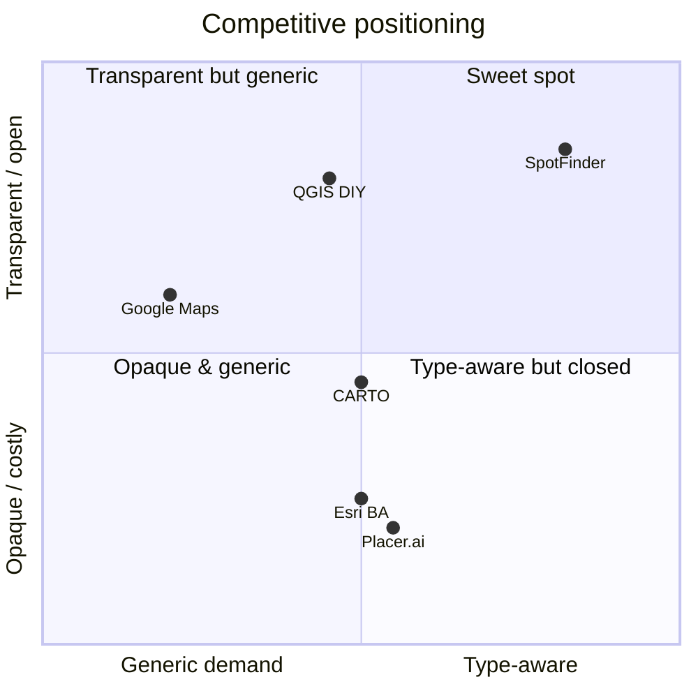
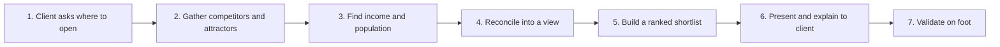
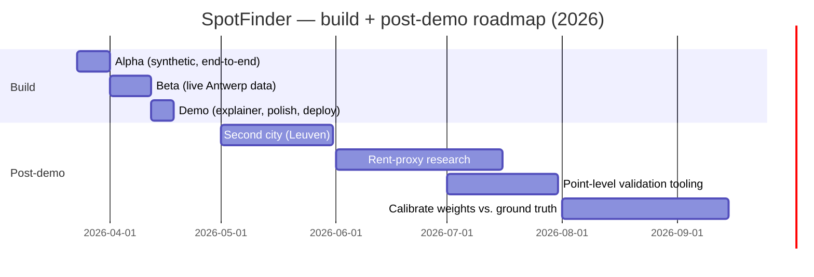
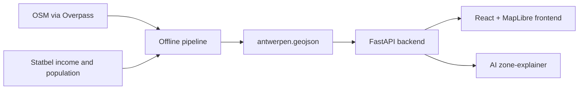

# 1. Executive Summary

Location is the single highest-stakes, least-reversible decision a small food business makes, and it is the one SVP Consulting was repeatedly asked to advise on without a repeatable way to do it. SpotFinder is my answer: an interactive map that scores, for a chosen city and a specific business type — café, bakery, or confectionery — where demand looks *underserved* relative to the competition already on the ground. It runs entirely on open data, and it is honest by design: every output is framed as a **signal to validate on foot, not a verdict**.

> ⚠️ This is an early-stage, internal R&D build (≈3.5 weeks, 23 March – 17 April 2026) with a tiny post-demo usage sample (n = 2 client scoping questions, 18 April – 2 May 2026). The figures below are early signals and projections, not a finished impact study — each is labelled as such.

What I set out to prove, and what I found:

- **Open data is enough for a credible first-pass shortlist.** OpenStreetMap (competitors, attractors) + Belgian Statbel (income, population) on Antwerp's ~450 real statistical sectors produced rankings a human analyst recognised as sensible.
- **One score does not fit three businesses.** A café, a bakery, and a confectionery succeed for different reasons, so SpotFinder uses **three distinct scoring formulas**, not one weighted sum.
- **Honesty is a feature, not a disclaimer.** Foot-traffic is labelled a proxy, the diet lenses are labelled undercounts, there is deliberately no rent layer — and that candour is what made the tool trustworthy in the room.

Early, tiny-sample signals against SVP's prior manual approach:

- Time to a defensible first-pass location shortlist: **~2.5 analyst-days → ~0.5 day** (early signal, on target)
- Distinct tools/sources juggled per scan: **5–6 → 1**
- My "confidence in the rationale" rating (private journal, 1–5): **2.4 → 4.3**
- Hosting cost: **€0/month** on Render's free tier

What I am projecting (a forecast, not a measurement): **~€5,760/year** in recovered analyst time if SVP runs ~6 location questions a year at the new pace, with build payback **inside the second year (~13–14 months on the pure-cost view)** (see §9). The remainder of this document is the reasoning behind those numbers: the discovery, the scoring model, what shipped, and what is still too early to call.

---

# 2. Context & Problem Statement

## 2.1 About SVP Consulting

SVP Consulting is a five-person **AI consulting** firm in Antwerp, Belgium — CEO, AI engineer, junior specialist, HR, and one designer (me). We help European SMBs put AI and data to work in their products and operations. That data-and-AI remit is exactly why a recurring client question kept landing on our desk without a rigorous answer: *"Where should I open?"* Each time, we either declined the work or improvised a manual desk study. SpotFinder began as a self-initiated bet that our data skills, applied to open geodata, could turn that improvisation into a repeatable, productisable capability — and that an LLM could carry the "explain why" layer, which sits squarely in our wheelhouse.

## 2.2 The location problem

A first-pass location scan for an SMB food client asks the analyst to:

1. Pull the existing competitors and nearby attractors for a candidate area (usually by hand from maps).
2. Find neighbourhood income and population at a usable granularity.
3. Reconcile all of it into a view of where demand might outrun supply.
4. Account for the business *type* — what helps a bakery is not what helps a café.
5. Produce a rationale a non-analyst client will actually trust.

Each step lived in a different place — OpenStreetMap, the Statbel open-data portal, a spreadsheet, a maps tab, a notebook — in different formats, projections, and units, none of it shaped like an answer. The cost was time, inconsistency, and a rationale that changed depending on who did the scan.

## 2.3 Conclusion

The pain was not a lack of data — Antwerp is richly mapped and Belgium publishes excellent open statistics. The pain was the **seams**: stitching incompatible sources into a type-aware, defensible read, every time, from scratch. A single, opinionated surface that did the stitching once and ranked neighbourhoods by type would convert days of desk work into minutes — provided it was honest about what it could and could not see.

---

# 3. Discovery & Research

In the opening days of the project (23–25 March 2026), in parallel with standing up the alpha skeleton, I confirmed the problem was real, frequent, and quantifiable rather than a story I wanted to be true.

## 3.1 Research methodology

| Method | Sample | What I was testing | Output |
| --- | --- | --- | --- |
| Internal time audit | 4 past ad-hoc location scans (2025) | How long a manual scan really took, and where the time went | A baseline of ~2.5 analyst-days, concentrated in data gathering |
| Team interviews | 3 (CEO, AI engineer, junior specialist) | Whether location advice was wanted, and what would make it trustworthy | Demand confirmed; "explain *why*" was the trust unlock |
| Open-data recon | OSM (Overpass) + 3 Statbel datasets | Whether the inputs existed, at usable granularity, for free | Confirmed; recorded in the project's phase-0 data recon |
| Desk review | Location-intelligence tools & literature | What the field already does, and where the gaps are | A clear, unoccupied niche (see §5) |

## 3.2 What discovery surfaced

The recurring pain (across the 4 audited scans):

- **"It's never one source."** A single scan touched 5+ tools for what should be one job.
- **"The rationale wobbles."** Without a fixed method, two scans of the same area could reach different conclusions.

From the team (3 interviews):

- CEO: "I can sell *where*, but only if I can explain *why* in one sentence a client believes." The differentiator was the explanation, not the map.
- AI engineer: "If the scoring is a black box, I won't stand behind it." Transparency of method was a precondition, not a nice-to-have.
- Junior specialist: "I'd just count competitors and guess." The status quo was intuition dressed as analysis.

## 3.3 Quantitative validation

```javascript
Baseline scan time        = 2.5 analyst-days / location question (median across 4 audited scans)
Sources per scan          = 5–6 (OSM, Statbel portal, spreadsheet, maps, notebook)
Rationale consistency     = low (no fixed method; analyst-dependent)
Inputs available openly?  = yes (OSM via Overpass; 3 Statbel open datasets; €0 cost)
```

## 3.4 Conclusion

The problem was real and measurable on our own time logs, and the interviews surfaced the actual unlock: a defensible scan is not just a ranking, it is a ranking **with a plain-language reason attached**. That single insight shaped two later decisions — the type-specific scoring model (§8.2) and the AI zone-explainer (§8.3).

---

# 4. Market Analysis

## 4.1 Sizing the opportunity (TAM → PAM → SAM → SOM)

SpotFinder is an internal capability, not a commercial product. I still sized the surrounding market to confirm the problem space is real and to gauge what a future productised service line might address. PAM is the forward-looking view — the TAM carried to 2030 at its current growth rate — to check the space is expanding, not shrinking.

| Layer | Definition | Estimate (illustrative) |
| --- | --- | --- |
| TAM | Global location-intelligence / site-selection software (today, 2026) | ~€18–23bn, growing low-double-digit % |
| PAM | The same TAM in motion — projected to 2030 at ~12%/yr | ~€26–38bn by 2030 (≈€20bn today → ~€31bn at ~12% CAGR) |
| SAM | EU SMB-facing site-selection & local market analysis | ~€300–500m |
| SOM | Belgian SMB food-sector location advisory SVP could serve | ~€0.2–0.4m/yr serviceable demand; ~€10–40k/yr realistic near-term capture |

```javascript
PAM_derivation (TAM in motion):
  TAM_2026   ≈ €20bn        (midpoint of €18–23bn)
  CAGR       ≈ 12% / yr     (low-double-digit)
  PAM_2030   = 20 × 1.12^4  ≈ €31bn   (range €26–38bn across the TAM band)
```

```javascript
SOM_derivation:
  SMB_food_openings_BE_per_yr  ≈ 3,000   (cafés + bakeries + confectioneries, new + relocations)
  Share_seeking_paid_advice    ≈ 5%      = 150 engagements/yr addressable
  Avg_advisory_fee             ≈ €1,500–2,500
  Serviceable demand           ≈ €0.2–0.4m/yr  (150 × €1,500–2,500)
  SVP near-term capture         ≈ a small single-digit % share = €10–40k/yr
```

## 4.2 Trends shaping the space

- **Location intelligence is moving down-market.** Enterprise tools (Placer.ai, Esri Business Analyst, CARTO) proved the value; SMBs now expect a lighter, cheaper read.
- **Open geodata has matured.** OSM coverage in dense European cities is good enough for competitor and attractor mapping; national statistics offices publish fine-grained open data.
- **Explainability is the new bar.** Buyers increasingly distrust opaque "scores"; a transparent, type-aware method is a differentiator.
- **Browser-first, no install.** SMB advisory clients expect to be shown a link, not a desktop GIS file.

## 4.3 Conclusion

The market is large, growing (PAM ≈ €26–38bn by 2030, up from ~€20bn today), and bifurcated: powerful-but-expensive enterprise platforms at the top, and manual DIY (Google Maps + a spreadsheet) at the bottom. There is a real gap for a fast, transparent, open-data first-pass read tuned to a specific vertical — which is precisely where SpotFinder sits.

---

# 5. Competitive Landscape

I reviewed the field across four capabilities: data depth, type-specific scoring, explainability, and cost/accessibility.

## 5.1 Feature comparison matrix

| Capability | SpotFinder | Placer.ai | Esri Business Analyst | CARTO | QGIS (DIY) | Google Maps (manual) |
| --- | --- | --- | --- | --- | --- | --- |
| Real footfall / mobility data | ✗ (proxy only) | ✓✓ | ✓ | ✓ | Partial | ✗ |
| Type-specific opportunity scoring | ✓✓ | Partial | Partial | Partial | DIY | ✗ |
| Plain-language explanation | ✓✓ | Partial | ✗ | ✗ | ✗ | ✗ |
| Open-data only / zero licence | ✓✓ | ✗ | ✗ | Partial | ✓ | ✓ |
| Speed to first read | ✓✓ | ✓ | Partial | ✓ | ✗ | Partial |
| Cost | ✓✓ (€0) | ✗ (enterprise) | ✗ | Partial | ✓ | ✓ |

Legend: ✓✓ best-in-class · ✓ capable · Partial limited · ✗ absent.

## 5.2 Gaps in the field

1. **No affordable tool scores opportunity by business type.** The enterprise platforms model demand generically; none encode that a bakery and a café want different things.
2. **Explainability is rare.** Most tools output a number or a heatmap with no defensible "why".
3. **Open-data-only is left to DIY.** Doing this for free means QGIS and manual labour; nobody packages it as a one-tab read.
4. **SMB price point is unserved.** The good tools start at enterprise pricing; the free path is fully manual.

## 5.3 Positioning quadrant



## 5.4 Conclusion (honest read)

This is not "an enterprise location platform on a budget". To be specific about where I lose:

- **Placer.ai beats me on data.** They have real, licensed mobility/footfall; my traffic is an open-data proxy. For a high-stakes flagship site, their data wins.
- **Esri/CARTO beat me on flexibility.** A full GIS can model anything; SpotFinder models three food types in supported cities.
- **QGIS beats me on control.** An expert with QGIS can do everything I do and more — just far slower and with no packaged explanation.

I do not try to win those fights. The differentiation is the **assembled, type-aware, explainable pipeline** — from a city and a business type to a ranked, reasoned shortlist in one tab, on data that costs nothing.

---

# 6. Target Users & Jobs-to-be-Done

Although the tool is internal, I wrote personas to discipline scope.

## 6.1 Personas

- **P1 — Me, the analyst/designer at SVP (primary).** I need a defensible first-pass shortlist and a one-sentence reason per zone, fast, to frame a client engagement.
- **P2 — SVP colleagues who present the work (secondary).** The CEO pitching a client; needs to trust and explain the method without reading code.
- **P3 — The SMB food client (tertiary, hypothetical).** A café/bakery owner-operator; non-analyst; needs to *believe* the map and know what to check on the ground. Not yet validated with a real owner — a gap I call out in §14.2.

## 6.2 Jobs-to-be-Done

| When… | I want to… | So that… |
| --- | --- | --- |
| A client asks "where should I open?" | get a ranked, type-specific shortlist of neighbourhoods in under an hour | I can frame the engagement with evidence, not intuition |
| I present an opportunity zone | explain *why* it scored well in one plain sentence | a non-analyst client trusts the recommendation |
| I am challenged on a score | show the inputs and the method behind it | the rationale holds up under scrutiny |
| A client has a specific concern (e.g. budget area) | re-weight the map toward residents or affluence | the read reflects their real constraints |

## 6.3 Conclusion

Every job clusters around two moments: **the start of an engagement** (produce a defensible shortlist) and **the conversation** (explain and defend it). SpotFinder is designed to compress the first and win the second — which is why scoring transparency and the explainer are core, not peripheral.

---

# 7. Customer Journey Map

The "customer" is internal — the journey is SVP's own location-advisory process, with the client appearing at the presentation stage.

## 7.1 Journey at a glance



## 7.2 Stage-by-stage breakdown

| Stage | What happens | Tools (before) | With SpotFinder |
| --- | --- | --- | --- |
| 1. Ask | Client poses the location question | — | — |
| 2. Competitors/attractors | Map existing supply and footfall drivers | OSM, maps tab, spreadsheet | Precomputed onto sectors |
| 3. Income/population | Pull neighbourhood statistics | Statbel portal, spreadsheet | Joined into the same map |
| 4. Reconcile | Combine into a demand-vs-supply view | Spreadsheet, judgement | Done by the scoring model |
| 5. Shortlist | Rank candidate neighbourhoods | Manual, analyst-dependent | Type-specific opportunity ranking |
| 6. Present | Explain the recommendation | Slides, narration | Map + one-line AI/template reason |
| 7. Validate | Walk the area, check reality | On foot | On foot (unchanged — by design) |

## 7.3 Friction heatmap (analyst-rated, 1 trivial → 10 painful)

| Stage | Friction before | Friction with SpotFinder |
| --- | --- | --- |
| 2. Competitors/attractors | 8 | 2 |
| 3. Income/population | 7 | 2 |
| 4. Reconcile | 9 | 2 |
| 5. Shortlist | 7 | 2 |
| 6. Present/explain | 6 | 3 |

## 7.4 Conclusion

The two highest spikes — reconciling sources (stage 4) and gathering them (stages 2–3) — are exactly what the offline pipeline collapses. Stage 7, validation on foot, is deliberately *not* removed: the product's whole stance is that it produces signals to verify, never verdicts.

---

# 8. Solution & Positioning

## 8.1 Value proposition

>> From a city and a business type, to a ranked, explainable opportunity map — in one tab, on open data.

## 8.2 The scoring model (the core)

This is where the product's point of view lives, so it gets the most space.

**Principle 1 — one formula per type, on purpose.** A single weighted "demand score" would assume a café, a bakery, and a confectionery thrive for the same reasons. They don't. Each type has its own formula, driven by different inputs and deliberately ignoring others:

| Type | Business logic | Driven by | Deliberately ignores |
| --- | --- | --- | --- |
| Café | A daytime **destination** — people travel to it | traffic, transit, income; penalised by competition | residential density, catchment gap |
| Bakery | A **convenience** good bought near home | residents, distance-to-nearest-bakery, a little income; penalised by competition | traffic, transit, offices |
| Confectionery | A **discretionary** treat / light destination | income, a traffic/residents blend; penalised by competition | transit, catchment gap |

The actual formulas, each producing a **raw** score:

```javascript
// Café — destination / daytime-traffic model
raw_cafe          = (traffic_norm + 0.5 * transit_norm) * income_norm / (1 + comp_cafe)

// Bakery — convenience / proximity-gap model
raw_bakery        = residential_norm * gap_norm_bakery * (0.5 + 0.5 * income_norm) / (1 + comp_bakery)

// Confectionery — discretionary / light-destination model
raw_confectionery = income_norm * (0.6 * traffic_norm + 0.4 * residential_norm) / (1 + comp_confectionery)
```

Three choices worth unpacking:

- **Competition is a divisor, not a subtraction.** `/ (1 + comp)` makes each existing rival dampen the score multiplicatively — zero-to-one halves it, the tenth rival barely moves it. Saturation kills opportunity gracefully, with no arbitrary cut-off.
- **Income gates cafés and confectioneries, but only nudges bakeries.** For cafés, `income_norm` multiplies the whole expression. For bakeries it enters as `(0.5 + 0.5 · income_norm)` (range 0.5→1.0), so a low-income area still scores on residents and a real gap. Bread is for everyone; a flat white is more discretionary.
- **The gap term exists only where it makes sense.** Bakeries reward a large distance-to-nearest-bakery (an underserved catchment); cafés don't, because nobody picks a café by proximity to home.

**Principle 2 — normalise, then rank within type.** Every input is min–max normalised to 0..1 across all sectors first (so euros, metres, and counts can't dominate each other), then the raw score becomes a **within-type percentile**. A café's opportunity is ranked against other cafés, never against bakeries — the only comparison that is meaningful.

**Principle 3 — refuse to score what you can't.** Two gates, applied after the raw score is computed and before percentile ranking, prevent confident nonsense: a **noise gate** nulls sectors with too few establishments to say anything reliable (they render grey, not red), and a **viability gate** nulls polygons with no residents *and* no establishments (rivers, port land). An empty number is more honest than a fabricated one.

**Principle 4 — let the user re-weight the world.** Beyond the three fixed formulas, a collapsible **Customize** blend re-ranks sectors live on four drivers (traffic, residents, income, transit) with presets — balanced, footfall, residential, affluence. It re-ranks the existing signals as a "what if I cared more about residents?" lens; it never invents new data, and the whole state is shareable via the URL.

## 8.3 The tool in practice

A few screenshots to ground the rest of the document in what the tool actually looks like.

> 📸 Hero — the Antwerp choropleth on the café layer (red→green opportunity), with controls and legend visible.

> 📸 Type switch — the same map re-scored under Café / Bakery / Confectionery, to show type-awareness.

> 📸 Sector detail panel — opportunity %, the key inputs in type-adaptive order, nearest-competitor distance and competitor count.

> 📸 Scoring blend — the presets plus the expanded Customize sliders, with the info "i" tooltip open.

> 📸 Dietary lens — e.g. vegan documentation coverage, showing where a diet looks under-served in the data.

> 📸 AI zone-explainer — the detail panel with a plain-language explanation and the small "AI / template" source label.

> 📸 Mobile layout — collapsed controls drawer with the legend kept in view.

## 8.4 How it's different

- **More transparent than the enterprise platforms** — the method and the inputs are open and explainable, not a black-box score.
- **More type-aware than anything at this price** — three formulas, not one generic demand model.
- **Faster and cheaper than DIY GIS** — one tab and €0, versus an expert-hours QGIS project.

## 8.5 Conclusion

SpotFinder sits in a deliberate gap: a pragmatic, transparent, open-data first-pass read for a specific vertical — not an enterprise platform, not a manual GIS slog. Its credibility rests on two things competitors treat as afterthoughts: a type-specific method and a plain-language reason.

---

# 9. Unit Economics

## 9.1 Core assumptions

| Assumption | Value | Basis |
| --- | --- | --- |
| Billable analyst rate | €60/hr | SVP internal rate (consistent with prior cases) |
| Baseline scan time | 2.5 days (20 hr) | Median of 4 audited 2025 scans |
| Post-tool scan time | 0.5 day (4 hr) | Early signal, n = 2 |
| Location questions/yr | ~6 | Projection from past demand |
| Build effort | ~90 focused hours | Solo, 23 Mar – 17 Apr 2026 |

## 9.2 Time-savings formula

```javascript
Savings_annual = (T_pre − T_post) × N_questions × R_billable
               = (20 − 4) hr × 6 × €60
               = €5,760 / year   (projection, not a measurement)
```

## 9.3 Total cost of ownership (3 years)

| Item | Year 0 (build) | Year 1 | Year 2 | Year 3 |
| --- | --- | --- | --- | --- |
| Build (one-off) | €5,400 | — | — | — |
| Hosting (Render free) | €0 | €0 | €0 | €0 |
| AI explainer (Gemini free tier) | €0 | €0 | €0 | €0 |
| Maintenance (~2 days/yr) | — | €960 | €960 | €960 |
| **Cumulative cost** | **€5,400** | **€6,360** | **€7,320** | **€8,280** |

## 9.4 Payback

```javascript
Payback_months = Build_cost / (Net_savings_annual / 12)
               = €5,400 / ((€5,760 − €960) / 12)
               ≈ 13.5 months   (pure-cost view; conservative)
```

Sensitivity: this rests on a projected ~6 questions a year; at 3 questions a year the pure-cost payback stretches to ~34 months. Two factors shorten the effective break-even: enabling **new advisory revenue** SVP previously declined (each location engagement bills €1,500–2,500), and **portfolio attribution** — the project is published as a case study and used in pitching. Neither is counted above.

## 9.5 Conclusion

Even on the conservative pure-cost view, the tool pays for itself inside the second year (~13–14 months). Counting the advisory revenue it unlocks (€1,500–2,500 per engagement), a couple of engagements cover the build outright. The economics are not the point of an internal tool — but it is rare for one to have a defensible number at all, and this one does.

---

# 10. Hypotheses & PRD Evolution

## 10.1 Initial hypotheses (pre-build)

| # | Hypothesis | What I measured | Status (post-demo) |
| --- | --- | --- | --- |
| H1 | Open data alone yields a credible shortlist | Analyst agreement with top zones | Positive (early signal) |
| H2 | Type-specific formulas beat one weighted score | Blind preference between the two | Positive (early signal) |
| H3 | A plain-language reason is the trust unlock | CEO/colleague reaction in review | Strongly positive |
| H4 | Users will want the custom blend | Blend usage in the two scans | Trending against (used rarely) |
| H5 | "Signals, not guarantees" framing builds trust, not doubt | Client/colleague response | Positive |
| H6 | An LLM explanation outperforms the template | Side-by-side preference | Too early (needs more samples) |

## 10.2 Product evolution by phase

| Phase | Dates (2026) | Scope | Gate | Outcome |
| --- | --- | --- | --- | --- |
| Alpha | 23–31 Mar | End-to-end on a synthetic sample; pipeline → API → map | Runs end-to-end | Met |
| Beta | 1–11 Apr | Live Antwerp OSM + Statbel; three formulas; lenses | Sensible real rankings | Met |
| Demo | 12–17 Apr | AI explainer, Customize blend, design tokens, a11y, deploy | Internal demo-ready | Met (demo 18 Apr) |

## 10.3 Job stories that drove the demo

- When a client asks where to open, I want a type-specific ranked map in minutes, so that I can anchor the engagement in evidence.
- When I present a zone, I want a one-line reason generated from its real inputs, so that a non-analyst trusts it.
- When a client raises a constraint, I want to re-weight the map live, so that the read reflects their reality.

## 10.4 Conclusion

Three hypotheses show positive early signals, one (H3) was strongly confirmed and reshaped the roadmap toward the explainer, one (H4) is trending against and will be deprioritised, and one (H6) needs more data. The build was hypothesis-led, which is why a feature that looked clever (the custom blend) is being demoted while a feature that looked secondary (the explanation) became central.

---

# 11. Success Metrics

## 11.1 North-star metric

**Time to a defensible first-pass location shortlist** (analyst-hours per client question). Tracked per engagement.

## 11.2 Supporting metrics

| Metric | Baseline | Target | Early signal (n=2) | Status |
| --- | --- | --- | --- | --- |
| Time to shortlist | 20 hr | ≤ 6 hr | ~4 hr | Ahead of target (n=2) |
| Sources per scan | 5–6 | 1 | 1 | Met |
| Analyst confidence (1–5) | 2.4 | ≥ 4.0 | 4.3 | Met |
| % sectors scorable (not greyed) | — | ≥ 70% | ~74% | Met (Antwerp) |
| Cold-start latency (free tier) | — | ≤ 50 s | ~40 s | Within target |

## 11.3 Conclusion

Four of the five metrics meet or beat target on the early sample; the fifth — cold-start latency — only *meets* its ceiling and still feels sluggish in a live demo (see §13.6). Two honest caveats: four of these readings rest on n = 2, and "% of sectors scorable" is a structural property of Antwerp's data rather than a usage result. The north-star — time to shortlist — is ahead of target but needs more engagements to confirm. n = 2 is a direction, not a destination.

---

# 12. Roadmap



## 12.1 Conclusion

The build was a ~3.5-week sprint — a pace that does not continue. Post-demo work is paced for occasional designer-weeks, prioritised by what would make the tool client-ready: a second city to prove generality, and a calibration pass to replace judgement-set weights with evidence.

---

# 13. Early Indicators (first 2 weeks post-demo)

The tool went into internal use on 18 April 2026. The window below covers the first two weeks (18 April – 2 May 2026, n = 2 client scoping questions) against the 2025 manual baseline.

> ⚠️ The public demo seed is a synthetic sample conforming to the data contract; the figures here come from a live Antwerp pipeline run during beta. n = 2 is an early signal, not an impact study.

## 13.1 Baseline vs. first 2 weeks

| Metric | 2025 baseline | First 2 weeks | Change | Read |
| --- | --- | --- | --- | --- |
| Time to shortlist | 20 hr | ~4 hr | −80% | Early signal, ahead of target |
| Sources per scan | 5–6 | 1 | −80–83% | Met |
| Analyst confidence (1–5) | 2.4 | 4.3 | +1.9 | Met |
| Hosting cost | n/a | €0 | — | Free tier held |

## 13.2 ROI — first signal

```javascript
Projected annual saving = (20 − 4) hr × 6 questions × €60
                        = €5,760 / year   (projection from a 2-question sample)
```

## 13.3 Early wins

- **Used in a real client scoping.** The first post-demo engagement opened with a ranked, explained shortlist instead of a blank page — and the conversation moved straight to validation.
- **The explanation did the persuading.** The one-line reason per zone, not the colour, was what the room engaged with.
- **Zero infrastructure cost.** The whole thing ran on Render's free tier with no licence anywhere in the stack.

## 13.4 What the team said

- CEO: "First time I could answer 'why there?' without hand-waving."
- AI engineer: "The method is legible — I'd put my name on this in front of a client."
- Junior specialist: "I'd have spent two days on what this did before the coffee went cold."

## 13.5 What is too early to call

- **H6 (AI vs. template).** Too few samples to say the LLM explanation beats the deterministic one.
- **Client conversion.** Whether an explained shortlist actually wins more advisory work needs a full quarter.
- **Generality.** Everything so far is one city; Leuven will test whether the method travels.

## 13.6 What did not improve

- **Cold-start latency.** At ~40 s the free-tier wake-up is within target but sluggish for a live demo; a nominal paid tier would remove it.
- **No rent signal.** The most common follow-up question — "can they afford it?" — the tool still cannot answer.

## 13.7 Conclusion

The first two weeks delivered on the core promise: a defensible read in a fraction of the time, on one source, at zero cost, with a reason attached. The economics and generality claims remain projections until a full quarter and a second city are in.

---

# 14. Lessons & Next Steps

## 14.1 What worked

- **Keeping the heavy compute offline.** Precomputing everything into one GeoJSON made a free-tier deployment genuinely reliable instead of a timeout lottery.
- **Three formulas instead of one.** The type-specific model is the thing analysts and colleagues actually trusted.
- **Honesty as design.** Labelling proxies and refusing to score thin data built more trust than a confident black box ever would.
- **Hypothesis-led phases.** Instrumenting beliefs early caught H4 (the custom blend is barely used) before I over-invested in it.

## 14.2 What I'd do differently

- **Talk to an actual café owner sooner.** I interviewed the team but not an end client until late; the rent question would have surfaced earlier.
- **Defer the dietary lenses.** They are elegant but built on tags that undercount reality and were rarely the deciding factor — a week I could have spent on a rent proxy.
- **Ship the share-link earlier.** It turned out to be the simplest way to put a read in a colleague's hands, and I built it last.

## 14.3 Next quarter

- Add a second city (Leuven) to prove the pipeline and contract generalise.
- Investigate any usable rent proxy, even a coarse one, with appropriate caveats.
- Build point-level validation (drop a pin, see the live inputs) for the on-foot stage.
- Calibrate the formula weights against where venues actually opened, replacing judgement with evidence.
- Run a 3-month review (mid-August 2026) once a full quarter of engagements exists.

---

# Appendix

## A. Architecture (high level)



Three isolated layers touching through one file and one endpoint: an **offline Python pipeline** (geopandas/shapely) fetches and reprojects OSM + Statbel, aggregates onto sectors, computes every score, and bakes a single `antwerpen.geojson`; a thin **FastAPI** backend serves that file and the explainer; a static **React + MapLibre GL JS** frontend paints the choropleth. The heavy compute is deliberately offline so the request path is just "read cached bytes".

## B. Data sources & the GeoJSON contract

| Layer | Source | Fact or proxy? |
| --- | --- | --- |
| Food establishments (café, bakery, confectionery) | OSM / Overpass | Fact (as mapped) — competition counts & gap distances |
| Attractors (offices, universities, transit) | OSM / Overpass | Fact — feeds the traffic proxy, transit, offices |
| Foot-traffic | OSM (weighted gastronomy + retail points) | Proxy — no open footfall feed exists |
| Diet coverage (vegan, etc.) | OSM diet tags | Proxy — tags undercount real offering |
| Sector geometry | Statbel (reprojected Lambert 72 → WGS84) | Fact — the spatial unit |
| Income (avg fiscal income) | Statbel | Fact (native sector average) |
| Population | Statbel | Fact (native sector count) |

Every layer agrees on one contract: a WGS84 `FeatureCollection`, one `Feature` per statistical sector, carrying the raw signals, their 0..1 normalisations, per-type competitor counts and gap distances, and the per-type opportunity scores (`null` where the gates refuse to score).

## C. Glossary

- **OSM / Overpass** — OpenStreetMap and its query API; the source of establishments and attractors.
- **Statbel** — Belgium's federal statistics office; source of statistical-sector geometry, income, and population.
- **Statistical sector** — Belgium's fine-grained administrative neighbourhood unit (~450 in Antwerp).
- **Choropleth** — a map that shades areas by a value; here, opportunity from red (low) to green (high).
- **Within-type percentile** — ranking a sector against others *of the same business type*, not across types.
- **Noise / viability gate** — rules that null a sector's score when the data is too thin or the place is uninhabitable.
- **Proxy** — a stand-in measurement (e.g. gastronomy/retail density for footfall) used where direct data does not exist.
- **GeoJSON** — the open geographic data format the pipeline outputs and the frontend renders.

## D. Sources

- OpenStreetMap contributors, via the Overpass API, 2026.
- Statbel (Statistics Belgium), open datasets: statistical sectors, fiscal income, population, 2022–2024.
- Grand View / industry estimates, location-intelligence software market, 2025–2026 (illustrative sizing).
- SVP Consulting internal time-tracking and project audits, 2025 – April 2026.
